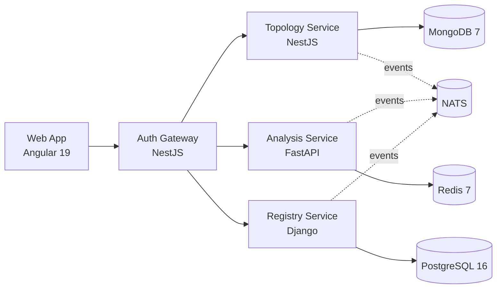

# Ripplemark

[](https://github.com/kushal-sharma-works/ripplemark/actions/workflows/ci.yml)
[](https://github.com/kushal-sharma-works/ripplemark/actions)
[](LICENSE)

Ripplemark is a distributed dependency-intelligence platform for microservice ecosystems. It combines service cataloging, dependency graph management, and change-impact analysis to estimate blast radius before release.

## Architecture



## Quick Start

```bash
git clone https://github.com/kushal-sharma-works/ripplemark.git
cd ripplemark/infra/docker
cp .env.example .env
docker compose -f docker-compose.yml up --build
```

After startup:

- Web app: `http://localhost:4200`
- Auth gateway: `http://localhost:3000`
- Topology API: `http://localhost:3001`
- Analysis API: `http://localhost:8000`
- Registry API: `http://localhost:8001`

Local login for testing:

- Email: `integration-admin@ripplemark.local`
- Password: `IntegrationPass123!`
- Prefer email/password for local runs (Google login is not the recommended local path right now).

## Tech Stack

| Layer | Technology | Version |
|---|---|---|
| Frontend | Angular + PrimeNG | 19.x |
| Gateway | NestJS | 11.x |
| Graph/Topology | NestJS | 11.x |
| Analysis | FastAPI | 0.115+ |
| Registry | Django + DRF | 5.1+ |
| Relational DB | PostgreSQL | 16 |
| Graph/Document DB | MongoDB | 7 |
| Cache/Queue | Redis | 7 |
| Messaging | NATS | 2.10 |
| Packaging/Deploy | Helm + ArgoCD | Helm 3 / GitOps |
| CI/CD | GitHub Actions | Workflows in `.github/workflows` |

## Documentation

- Architecture deep dive: [docs/architecture.md](docs/architecture.md)
- ADRs: [docs/decisions](docs/decisions)
- Onboarding guide: [docs/onboarding.md](docs/onboarding.md)
- API quick guide: [docs/api-guide.md](docs/api-guide.md)
- Local run guide: [docs/local-run.md](docs/local-run.md)
- Google OAuth local setup: [docs/google-oauth-local-setup.md](docs/google-oauth-local-setup.md)

## Project Structure

```text
ripplemark/
├── apps/
│   ├── analysis-service/
│   ├── auth-gateway/
│   ├── registry-service/
│   ├── topology-service/
│   └── web-app/
├── libs/
│   ├── api-contracts/
│   ├── auth-utils/
│   └── domain-models/
├── infra/
│   ├── docker/
│   ├── helm/
│   ├── k8s/
│   └── argocd/
├── ci/
├── docs/
│   └── decisions/
└── .github/workflows/
```

## Contributing

1. Create a branch from the current integration base branch.
2. Keep changes scoped to a single prompt/theme.
3. Ensure tests/lint pass for modified services.
4. Update docs/contracts when behavior changes.
5. Open a PR with validation evidence and impact notes.

## License

MIT License. See [LICENSE](LICENSE).

